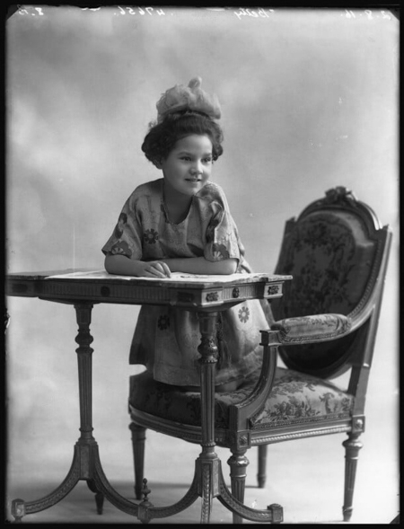
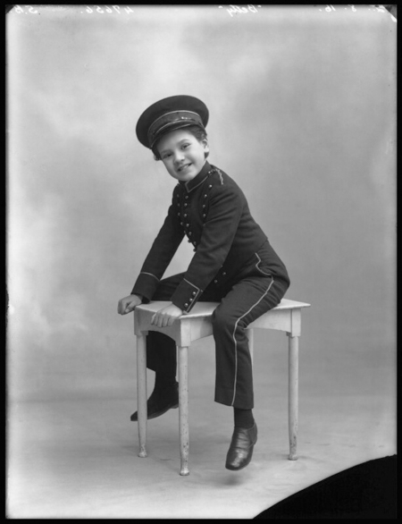

---
layout:		page
title:		Biography of Betty Bolton
permalink:	/biography/
description: >
  A biography of actress and singer Betty Bolton (1906-2005)
image:
  path: /assets/img/sidebar-bg.jpg
---

by A. G. Kozak

- Table of Contents
{:toc}

## Introduction

On November 1, 1926, London listeners who had tuned in to BBC radio would have heard something new: immediately following a performance of the comedy duo [Clapham and Dwyer](https://en.wikipedia.org/wiki/Clapham_and_Dwyer), there was a segment by Mimi Lafleur, a "French comedienne" singing "light ballads."[^1] No one had heard her on the radio before, and, in a way, no one would hear her again, for she was not a person, but a character. This was Mimi Lafleur's only radio performance, but it was also Betty Bolton's first of many.

At twenty years old, Bolton was a ten-year veteran of the London stage. She had every reason to think that she would be welcomed as a contributor to the BBC's programming. Her castmate from *Back Again* (1919), Elsie Carlisle, had [been on the radio for eight months already](https://www.elsiecarlisle.com/elsies-first-radio-broadcast-1926/). Bolton applied to do work for the BBC under her own name---naturally---and was rebuffed. But she would not accept rejection.

"I speak French fluently," she explained to the press after her successful radio broadcast, "and, greatly daring, I returned some days later. 'Can I see ze gentleman who geeves ze engagements?' I asked in my best broken English." She then gave them the name "\[Mademoiselle\] Mimi Lafleur"---a French comedienne, apparently.[^2]

The aftermath of the hoax was delightful. The newspaper headlines read:

- "A Joke on the B.B.C.: Why English Girl Was Engaged (French Pose)"[^3]
- "Bluffing the B.B.C."[^4]
- "B.B.C. Spoofed: How Rejected \[Nottingham\] Actress Scored"[^5]

A Scottish paper even used the incident as an excuse to complain about the inordinate cachet that all things French enjoyed in Britain.[^6] A BBC official who had interacted with "Mademoiselle Mimi" recounted that he had noticed that Bolton's accent was definitely not a Parisian one---but he admitted that he was sure she was definitely some sort of genuine French person, perhaps a Basque, explaining:

> I know nothing about the actual engagement, but I can assure you that her turn was not accepted merely on the ground that she was French. The fact is that she was able in her French guise to provide the novelty that was necessary.[^7]

This was not even the last time that Bolton would perform in French on BBC radio. In one of her last known appearances, she sang French nursery rhymes.[^8] She had a great love of impersonation and particularly liked playing non-English roles. Mostly, though, the story of Bolton's original radio performance is an example of an actress redirecting the high-spirited, zany energy of the comedic theater into her own struggle to be recognized as a potential radio star. In the aftermath of the hoax, the BBC had egg on its face, and as a result, it is possible that Bolton experienced a temporary setback to being embraced by that establishment---but long term, she would prove to be an utter success.

## Origins and Childhood

{: style="text-align: center;"}

"Betty Bolton as she used to be---not so many years ago!"  
From an article by Madame \[Maud\] Bolton, *Radio Pictorial*, July 3, 1936  
From the collection of Terry Brown
{:.figcaption}

Maud Elizabeth Tildesley was born on January 26, 1906 in Nottingham to Francis John Tildesley and Helen Maud Tildesley, née Bolton. Her father was an accountant in the postal service, according to the birth registry, while her mother was a dancing teacher: "Madame Maud Bolton." From an early age, Maud Elizabeth was known by a diminutive of her middle name and by her mother's surname: "Betty Bolton." Madame Bolton seems to have inherited her dance school from another teacher in the year after Betty's birth[^9] and certainly oversaw a thriving operation,[^10] which she may have run with the help of her younger sister Annie Christine.[^11]

By 1911, Betty Bolton was living with her mother and aunt at her maternal grandparents' house. By 1914, eight-year-old Betty caught the notice of a reporter covering her mother's concert for wounded soldiers.[^12] Two years later, she would be featured for the first time, in various comic roles, on the London stage.

## Stage

{: style="text-align: center;"}

[Betty Bolton as the Real Child in the 'Nursery' scene in 'Some'](https://www.npg.org.uk/collections/search/portrait/mw73359/Betty-Bolton-as-the-Real-Child-in-the-Nursery-scene-in-Some?LinkID=mp66598&role=sit&rNo=7)  
by Bassano Ltd (2 August 1916)  
© National Portrait Gallery, London
{:.figcaption}

Of the various entertainment contexts in which Betty Bolton appeared, it seems best to begin with the stage, for the public and the critics first knew her as an extraordinarily talented child actress. She may have even encountered some of her earliest and most consequential influences during her extensive work in theater.

First, though, it might be best for me to make a particular observation about Betty Bolton's acting career. She started out, as a child, regularly playing boys as much as girls, not for want of any femininity on her part, but because of a special talent for male impersonation. As she got older, she added nationalities to her comic toolchest. Described as a "dark-eyed, southern \[European\]-looking girl,"[^13] she seems to have had the ability to imitate a foreigner with ease. Her own mother observed:

> There is no need for Betty to make-up for a good many of her dusky rôles. She has a lot of Spanish blood in her veins, and, at times, especially when she is roused, she looks just like a southerner.[^14]

Near the end of her public career, Betty Bolton herself described to a journalist how she had been cast in films:

> Chatting to Betty Bolton the other day, she made the remarkable claim that out of all the pictures in which she has appeared, she has never been allowed to appear as an English girl.
>
> "In fact," she said, "I've never even spoken a word of English on the screen! The very first picture I made was *The Wolves* at Elstree. I played my original stage part of the Eskimo girl; and I had to sing and speak in the Eskimo language all the time.
>
> "In another picture, I appeared as a Spanish girl, and in other films I've been Russian. So I'm wondering what I shall be asked to do next!"[^15]

I think it is helpful to acknowledge Bolton's status as a sort of chameleon of the stage and screen as a general principle---it explains her casting.

{: style="text-align: center;"}

[Betty Bolton as the Super-Child in the scene 'A Modern Mother's Meeting' in 'Some'](https://www.npg.org.uk/collections/search/portrait/mw73352/Betty-Bolton-as-the-Super-Child-in-the-scene-A-Modern-Mothers-Meeting-in-Some?LinkID=mp66598&role=sit&rNo=0)  
by Bassano Ltd (2 August 1916)  
© National Portrait Gallery, London
{:.figcaption}

Bolton's first roles were in a 1916--1917 revue written by veteran actor and author [Harry Grattan](https://en.wikipedia.org/wiki/Harry_Grattan), produced by [André Charlot](https://en.wikipedia.org/wiki/Andr%C3%A9_Charlot), and starring American songstress Lee White[^16]---a constellation of theater personalities with whom Bolton would often collaborate. The show went under the curious title *Some*, an abbreviation of *Some (More Samples)*, which in turn was short for *Some More Samples of Odds and Ends*, a reference to previous successful revues by Grattan, *More (Odds and Ends)* (1915--1916) and *Samples* (1916).[^17] In *Some*, Bolton (billed simply as "Betty"---no surname) played three characters: two girls and one boy. Her considerable talents were noticed by the critics. *The Sketch* remarked:

> Little Miss Betty Bolton is probably the youngest actress on the London stage---at any rate taking a part of importance. She is only ten and a-half, but she can speak, and act in, French and Italian, besides various dialects. In "Some," the revue at the Vaudeville, where she is described on the programme merely as "Betty," she makes a great hit, first as the Call-Boy, and later as the Super-Child in "A Modern Mothers' Meeting," and as the Real Child in "The Nursery." Betty has twice performed before Queen Alexandra, who was delighted with her turn. A real "infant phenomenon" is this wonderful little lady.[^18]

Alexander Bassano took photographs of young Betty dressed as these various characters, some of which are reproduced on this page; the rest of them may be seen on the [Images](/images/#1916) page of this website.

{: style="text-align: center;"}

[Betty Bolton as the Call-Boy in the dressing-room scenes in 'Some'](https://www.npg.org.uk/collections/search/portrait/mw73356/Betty-Bolton-as-the-Call-Boy-in-the-dressing-room-scenes-in-Some?LinkID=mp66598&role=sit&rNo=4)  
by Bassano Ltd (2 August 1916)  
© National Portrait Gallery, London
{:.figcaption}

Another Grattan--Charlot production, *Cheep* (1917--1918), also starring Lee White, had roughly the same cast as *Some*, including Betty Bolton (now billed for the first time using her first and last names).[^19]  She seems to have played a male and a female character, both children.[^20] At least one critic remarked upon Bolton's "astounding precocity."[^21] Another show, *Us* (1919), written by Grattan and this time produced by Lee White herself (along with her husband and frequent co-star Clay Smith), featured Bolton as an ex-army call-boy.[^22] She was about thirteen at the time, and a newspaper reported:

> Betty Bolton, the clever little actress in "Us," celebrated her 13th birthday last week, and Miss Lee White gave her a dressing-room tea-party and a real birthday cake with plums inside and candles outside. Moreover, on account of her advanced age, Betty is to appear on the programme in future as Miss Betty Bolton instead of just "Betty."[^23]

Lee White's next production was *Back Again* (1919), and this time the cast included Elsie Carlisle in her first London role.[^24] Bolton appeared as "Betty-All-Alone (Only 13 and comes from Nottingham, so she wants your sympathy)."[^25] It is interesting to note that Bolton's mother, Madame Maud Bolton, was employed in *Back Again* as "producer and ballet mistress" (at this time she seems also to have been independently directing ballets).[^26]

{: style="text-align: center;"}

"Back Again" (1919) sheet music depicting Lee White
{:.figcaption}

When the successful show toured abroad, Bolton left it and joined Basil Dean's *Fifinella* (1919), the last show in which she played a child.[^27] In this elaborate fairy tale, Bolton was cast as a boy character.[^28]

In a strange turn of events, January 1921 saw Bolton performing in the Crystal Palace Circus impersonating Japhet, a raucous wooden-puppet-like character derived from the popular *Daily News* comic strip *The Adventures of the Noah Family* (which does not seem to have had any religious theme, in spite of the suggestive names).[^29] The *Daily News* proudly documented her antics with photographs of her in costume, dressed as an awkward boy, wearing a wig.[^30] "One of the cleverest child actors on the London stage, Betty Bolton is Japhet," the paper reminded its readers, "and the children all know and delight in him."[^31] Her mother would recount years later:

>At one time she was clowning at the Crystal Palace circus. Her part was to fool about the whole time, interrupting acts and making a general nuisance of herself. There is always one clown who does this.
>
> There was a chariot race at every performance. The horses used to charge round the sawdust-track at a break-neck speed. Betty thought this was great fun, and would run across the track within ten yards of the dashing chariots and horses.
>
> This gave the audience a great thrill, but it very nearly turned my hair white. You can guess how thankful I was when the circus was all over.[^32]

By the end of January, the paper would claim that over 200,000 people had seen her reenact the zany adventures of their pen-and-ink persona.[^33] In the summer of 1921, Bolton continued her hiatus from serious theater by playing roughly twenty different characters in a "Fantasy Fair" at the Sandown Pier Pavilion on the Isle of Wight.[^34] Among other characters, she played Hamlet and [Maurice Moscovich](https://en.wikipedia.org/wiki/Maurice_Moscovich)...and her mentor, Lee White![^35]

By December 1921, she was featured in *Minstrels of 1922* at the Philharmonic Hall, a blackface variety show.[^36] It seems likely that Bolton was made up like the rest of the troupe: she may have been made up thus in a later performance.[^37] By engaging in this now unacceptable form of comedy, she may have been a creature of her times. It is possible that she considered it just another one of her exotic roles.

In February 1922 Bolton teamed up with comedian Nat Maddison for a musical show called *Something New* at the Derby Hippodrome.[^38] By May she was performing in a touring show called *Pantaloonacy*, a succession of burlesques. One reviewer observed that "Betty Bolton was especially prominent for her studies of peoples of nations other than British, and for her elocutionary powers."[^39]

In 1924 Betty Bolton had her last collaboration with Lee White. A member of the press remarked, "Betty Bolton, the small girl who used to appear with Lee White at the Vaudeville, returns as a grown-up."[^40] The Harry Grattan "song-show" *Come In* would be Australian Billee Lockwood's first London production---she would go on to record noteworthy British records---but it was a short-lived one. The booing was so bad the first night that White's husband Clay Smith angrily addressed the audience as "ladies and gentlemen---and *you*," causing things to get worse.[^41] Adjustments were made, and scenes were cut, but all to no use---the show folded in three weeks.

Before we take our leave of Lee White, there is a question of influence that is worth considering. Terry Brown has observed,

> Lee White might be described as one of the first 'torch' singers, with a bluesy, laid back approach.... \[H\]er eventual influence on Betty's singing style is quite evident when you compare their voices.[^42]

Back in 1924, an Aberdeen reviewer described Lee White's "secret":

>...personality, brimming over... ...her husky tones have a charm that is denied to many prima donnas.[^43]

The description of White fits Bolton to a tee. With 115 known record sides, we are in a position to assess Bolton's charms as a singer, which partially derive from a marriage of a "bluesy," "husky" voice with a bold attitude.

We are fortunate that Lee White recorded quite a number of songs. I would encourage my readers to listen to her ["Wedding in Dollyland,"](https://www.youtube.com/watch?v=cxiKBy5O8sA) a song from the 1919 show *Back Again* that included Betty Bolton in its cast. White stands out as an idiosyncratic singer whose voice clearly dripped with character. When we consider that Lee White must have defined success for the child Betty, it is no wonder that as Bolton developed as a singer, she chose to embrace her own quirks and ended up with a vocal style that is instantly recognizable and utterly lovable.

In late 1924, Bolton took up the role of "Almond Eye," a slave girl, in *The First Kiss*, an English-language adaptation of the Spanish *[zarzuela](https://en.wikipedia.org/wiki/Zarzuela)* *El Asombro de Damascus* by Pedro Luna (based on *The Arabian Nights*). A photograph exists of her heavily made up to play the role. The show had a short run, after which she took a couple of years off to look after her mother.[^44]

In 1927, Bolton returned to the stage in [*The Dybbuk*](https://en.wikipedia.org/wiki/The_Dybbuk), an originally Russian-language play concerning demonic possession that had been translated into Yiddish and thence to English. Later in the year, she played one of her more remarked-upon characters in *The Wolves* (a crime story set in Greenland) as the Inuit woman Naroutcha:

> In the comparatively small rôle of Naroutcha Miss Betty Bolton also scored...
>
> ...\[L\]ittle Betty Bolton, whom I remember in revue, achieves wonders of pantomime as the Eskimo, and with only two words to say.[^45]

Industry magazines featured photographs of Bolton at the moment when she knifes her lover in the play.[^46] (I shall return to the topic of *The Wolves* in the next section, as it was adapted into a sound movie and Bolton was in it.)

In 1928, Betty Bolton appeared weekly, for nearly five months, on a BBC radio program produced by André Charlot called *Charlot's Hour*, along with Harry Grattan and various other actors associated with Charlot, among whom was Barrie Oliver, an American performer billed as "London's Boy Friend." Bolton and Oliver also teamed up with actor [Davy Burnaby](https://en.wikipedia.org/wiki/Davy_Burnaby) at the Piccadilly Hotel in a cabaret act called *The Piccadilly Revels*. It is not clear to me what sort of act it was, but the fact that one promotional photo shows the two actors pretending to ride on Bolton's back[^47] while another shows them on hands and knees while she controls them using something like leashes[^48]---well, the marketing department must have wanted people to imagine the show as racy.

Near the end of August, Bolton became part of the cast of *Charlot's 1928 Revue* (for which Grattan had done some of the writing),[^49] in which she played, among other characters, Peter Pan in his Kensington Gardens environs, as well as a Burmese princess.[^50] She was also paired with Barrie Oliver, with whom she danced "The Table Dance" and "The One-Way Walk." There was an associated short film of "The Table Dance," *Table Top Toes* (1928), which I discuss below. For a time, Oliver and Bolton would perform together at the Café Royal with Hal Swain's band and Oliphant Chuckerbutty on the organ.[^51]

In 1930, Betty Bolton was very much noticed in a London production of African American playwright Garland Anderson's play about racial prejudice.[^52] She played a Black servant.[^53]

## Film

Let us return to the short film *Table Top Toes* (1928), shot for the series of short films *Eve's Review (No. 358)*. It is the one Betty Bolton film that is readily accessible to the public, and though it is silent, it gives such a good idea of Bolton's outstanding talent as a dancer. During the performance, she is confined to the space of a small table that she must share with "London's Boy Friend" Barrie Oliver. I encourage the reader to view the film [on British Pathé's website](https://www.britishpathe.com/asset/63113/).

Regarding this film, the *Newark Advertiser* observed:

> Amateur dancers often speak of the difficulty of dancing in a crowded ballroom, but these two experts gave a display on a 36-inch table. It was calculated that the pair introduced 450 steps in 135 seconds. A great variety of movements was included in this number.[^54]

The two move their bodies about as much as is conceivably possible considering their precarious situation. They tap-dance vigorously; they shift their weight towards and away from one another in perfect timing (any deviation from the choreography would necessitate a fall); they do the Charleston without their legs colliding; and they just get progressively sillier and ever more entertaining as the film proceeds. There is even a slow-motion sequence that shows off their virtuosity nicely. In the end, *mirabile visu*, she leaps from the small platform of the table up into his arms as he remains standing on its surface.

It is worth viewing the film a second time, paying more attention to Bolton's face than to her feet. The whole time that she is dancing, she projects attitude. Her fun, carefree girlishness is so infectious that I can easily understand why audiences at the revues must have delighted in her entertaining qualities.

In 1928, Bolton appeared in [*Balaclava*](<https://en.wikipedia.org/wiki/Balaclava_(film)>),[^55] a film shot in color but shown in black and white that was also silent (but with a synchronized score and some sound effects), produced by Michael Balcon. Its theme was the charge of the Light Brigade in the Crimean War, and Bolton played "Natasha," one of the Russian characters.[^56] [The severely abbreviated version of the film](https://archive.org/details/BALACLAVACyrilMcLaglenSilent) that is available on the internet does not seem to have any of her scenes.

Betty Bolton reprised her role of Naroutcha in [*The Wolves* (1930)](<https://en.wikipedia.org/wiki/Wolves_(1930_film)>),[^57] a talkie film adaptation of the 1927 play with [Charles Laughton](https://en.wikipedia.org/wiki/Charles_Laughton) in the leading role and [Dorothy Gish](https://en.wikipedia.org/wiki/Dorothy_Gish) brought over from America to play the leading lady. Bolton also appeared in [*The Call of the Sea* (1930)](<https://en.wikipedia.org/wiki/Call_of_the_Sea_(film)>), a naval talkie picture.[^58]

Bolton's last film appearance would appear to have been in 1933's [*Long Live the King*](https://www.imdb.com/title/tt0024268/), a comedy starring [Florence Desmond](https://en.wikipedia.org/wiki/Florence_Desmond) that takes place in a Ruritanian setting amidst political revolution, with Bolton playing "Red Anna."

## Radio

I began this short biography with an account of Betty Bolton's madcap first foray into radio broadcasting. It was the impression of the press that the BBC was embarrassed after falling for her ruse, and perhaps that was the case. For what it was worth, Bolton did not return to radio for the rest of that year or the next. It was only in April 1928 that she found more opportunities to be on the radio, this time through her connection to producer André Charlot, who put her in twenty-one episodes of *Charlot's Hour*, after which she returned to the stage in *Charlot's 1928 Revue*. Before the year was out, she was on the BBC again with her Charlot co-star Rex Evans singing "songs and duets."[^59]

In 1929, Bolton continued to get BBC work through her Charlot comrades. *Charlot's Hour* had had comedy sketches called *'Erb and Emma* written by Harry Grattan, and he and Bolton played the title characters together on at least two occasions.[^60]

{: style="text-align: center;"}

Betty Bolton in *Wireless Magazine* (September 1929)  
From the collection of the late Mick Johnson
{:.figcaption}

From 1930 to 1932 she featured in the first two installments of *Going South*, reminiscences of American plantation life, which derived from a story on *The Children's Hour*, a show on which Bolton would gradually become a fixture. One of her radio co-stars was banjoist Tarrant Bailey Jr. Bolton's voice would ultimately be heard on his "Old Time Selections" (Imperial 2882) singing "Old Black Joe."

In May 1933, Betty Bolton participated in a radio play called *Tickets, Please* about a touring theater troupe that is stuck at a train station.[^61] Later in the year, she featured in *Carnival* (a [Compton Mackenzie](https://en.wikipedia.org/wiki/Compton_Mackenzie) play about London before World War I),[^62] on *The Children's Hour*,[^63] and in a stage show called *Popular Numbers* that was broadcast from the Blue Horizon Country Club in St. Mellons, Wales.[^64]

In 1934, Bolton returned at least twice to *The Children's Hour*. She also featured in *The White Keys*, a show that was relayed live from the Summer Theatre in Newquay, Cornwall.[^65] She made a similar number of performances in 1935, playing "Magnolia, \[the\] old coloured servant" in *Hit the Deck*,[^66] with roles in the third installment of *Going South* (produced on *The Children's Hour*)[^67] and in compère John Watt's thirty-eighth installment of *Songs from the Shows* (alongside the Three Ginx).[^68]

In 1936, Bolton was featured again on *The Children's Hour* singing French nursery rhymes[^69] and in a light entertainment show called *How's That?*[^70] In 1937, she made one last performance on *The Children's Hour* in a play titled *Prisoners of War*,[^71] and her final broadcasts (as far as I can tell) were in the *Empire Follies* from April--May 1937.[^72]

{: style="text-align: center;"}

Advertisement for Betty Bolton's "Empire Follies" Broadcast (1937)  
*Radio Pictorial*, 1937
{:.figcaption}

Bolton was clearly a noteworthy and popular radio star, and yet when one surveys the public record of her broadcasts, it seems a little sparse. Perhaps the reason is that radio was not the only medium she was broadcasting in.

## Television

Connoisseurs of interwar British entertainment will be familiar with the film [*Elstree Calling* (1930)](https://www.kozaksclassiccinema.com/elstree-calling-1930/), a movie revue roughly comparable to the better known American [*King of Jazz*](https://www.kozaksclassiccinema.com/king-of-jazz-1930/) from the same year. In *Elstree Calling*, early in the film, a character played by [Gordon Harker](https://en.wikipedia.org/wiki/Gordon_Harker) tries to use his television to tune in to the show that the film audience is watching, but his contraption breaks. He is shown trying to fix it over the course of the movie, and he succeeds just as the show is ending. The broken-television scenes, which incidentally may have been directed by Alfred Hitchcock, are one of the earliest popular-culture references to the existence of the technology of television.

{: style="text-align: center;"}

John Logie Baird in 1917 ([Wikipedia](https://en.wikipedia.org/wiki/John_Logie_Baird))
{:.figcaption}

Scottish inventor John Logie Baird created mechanical television in 1926 and by September 1929 was overseeing regular broadcasts. His process involved shining a very bright light onto a subject and allowing the light to be reflected through a spinning disc with a spiral of holes in it. A photoelectric cell would register the changing brightness and convert it into an electrical signal for radio transmission. On the other end, when the signal was received, it caused a lamp to flicker; the light from the lamp was then directed through a slit and another spinning disc, creating a moving image on a ground glass plate.[^73]

This moving image consisted of 30 vertical lines. Baird television was always in portrait mode, with a 3:7 aspect ratio, so it was perfect for representing a person's head and shoulders---or their whole body. The reproduction of sound and video depended on simultaneous but separate transmissions. In total, no more than a few thousand Baird "Televisors" (television receivers) were ever sold.[^74] At £26 (roughly £2,000 in today's money), they would have been prohibitively expensive for most people during the Great Depression. But in addition to the official Baird receivers, television kits were available, and magazines explained how to make Televisors out of components. By 1934--1935, somewhere between 8,000 and 20,000 people may have been watching television.[^75] But Baird ran experimental broadcasts from 1929--1932, and the BBC did regular, official programming from 1932--1935---a duration that makes Baird television a success by any standard.

And Betty Bolton must have counted as part of that success. She seems to have been a particular favorite during the experimental period when Baird was producing the programming himself (but using BBC transmitters). A quick survey of newspaper announcements of television transmission turns up five Betty Bolton appearances in 1930, thirteen in 1931, and another five in 1932 before the BBC took over programming. It is not always clear from the papers exactly what  she would have been doing on screen---song-and-dance numbers, no doubt. In newspapers from 1931, I see references to things on television such as "...some national head-dresses displayed by Betty Bolton, with appropriate national music" [^76] and "a group of four dances in national costumes by Betty Bolton."[^77] As usual, Bolton ended up impersonating foreigners.

Official BBC television broadcasts began on August 22, 1932, and Bolton was on the very first program. The historic importance of that transmission was not lost on the press and the general public, and some of our more interesting descriptions of artists' experience of being on television date from around that time. A much-reproduced, iconic photo of Betty Bolton and actress [Betty Astell](https://en.wikipedia.org/wiki/Betty_Astell) doing their makeup before the production was described by *The Sketch* thus:

> The artists who contributed the variety programme had to make up specially for the television---with dead greyish white on their faces, blue lips and eyebrows, and blue shadows on each side of the nose.[^78]

Bolton's co-star Fred Douglas would confirm the details of the outlandish makeup (made more awkward, no doubt, by the fact that he was also in blackface), and also described the unpleasant experience of looking into the bright arc lamp that made the transmission of moving pictures possible.[^79] Even the actors' clothing had to be especially suited to the bright light, and Madame Maud Bolton---who was acting as Betty's assistant---became something of an expert in dressing her daughter for these occasions.[^80]

During the course of the first official BBC television programme, "\[Betty\] Bolton sang and danced, and was shown full length."[^81] Another reporter remarked that "\[she\] came through very well, and her various movements during the singing of her songs could be followed quite clearly."[^82]

Bolton went on to appear on at least four more television programs that year, followed by another six in 1933, six in 1934, and two in 1935. Her on-air acts were most frequently described as "songs and dances." It should be noted that the Baird technology was abandoned in 1935. The BBC replaced it in 1936 with a system that offered higher fidelity.

John Logie Baird had experimented with another technology in the 1920s, something he called "Phonovision." Phonovision was to be a way of recording video to disc, much as 78 rpm records could encode audio. Baird successfully made the first videodiscs, but he was unable to play them back. By the mid-1930s, however, people were beginning to have more success video-to-disc technology. The following recording of Betty Bolton performing on television, made on an aluminum disc, probably around 1934--1935, was successfully decoded by Dr. Donald F. McLean:

<iframe class="youtube-video" style="display: block; margin 0 auto; padding-top: 35px" src="https://www.youtube-nocookie.com/embed/G3CFkK5OORw?si=XMqkc1E3qPgE0x6P" title="YouTube video player" frameborder="0" allow="accelerometer; autoplay; clipboard-write; encrypted-media; gyroscope; picture-in-picture; web-share" referrerpolicy="strict-origin-when-cross-origin" allowfullscreen></iframe>
30-line TV Video Recording of Betty Bolton in the 1930s  
Copyright 2013 D F McLean
{:.figcaption}

It should be noted that the disc encoded only video, not audio; the audio used in the restored video on YouTube is merely for effect (and it derives from Imperial 2552, a disc three or four years older than the aluminum videodisc). Dr. McLean was able to confirm the singer's identity with the help of Bolton's daughter, Judyth Knight, who "recognized her mother's *mannerisms*."[^83] The image quality was not good enough for a lip-reader to identify the lyrics being sung. Betty Bolton herself would eventually see the restoration and conclude from her own gestures that she had been singing a love song.[^84]

Genuine thirty-line television would have been considerably clearer than what can be restored from the aluminum disc, but one has to admit that just as seeing Bolton dance silently in *Table Top Toes* is a precious opportunity, getting even a rough idea of how she acted when she sang is an unexpected pleasure.

## Records

Betty Bolton recorded 115 record sides in six years (March 1929--February 1935). In fact, she recorded 90% of those sides between March 1929 and December 1932, in under four years. She is therefore in no way a minor British vocalist, but rather a prolific and noteworthy one who flourished for a comparatively short time. The years of her greatest activity coincide with a sort of classical age of popular music, when Tin Pan Alley, Broadway, the London stage, and Hollywood were originating some of the finest tunes ever composed. Bolton's records are therefore a precious repository of the songs of her day, and we continue to benefit from her unique interpretations of them.

For details of individual records, readers should consult my Betty Bolton discography *[Up in the Clouds](https://bettybolton.co.uk/discography/)*. Here I shall give a general picture of the arc of her career as a recording artist.

Bolton started out with a contract with Columbia.[^85] Between March 1929 and the end of August 1930 she recorded forty-one record sides for them, of which thirty-eight were commercially issued (for any artist it was normal that the occasional song would not be issued). Some of those records were released under her name, while others had the band's name printed on them. The fact that she is sometimes also credited alongside the band[^86] is an unusual testament to her reputation as an artist. Columbia executives must have thought that including her name on the label would increase sales. During this period, she was paired up, on her solo records,[^87] with pianist Edward Cooper and sometimes also guitarist [Len Fillis](https://www.albowlly.club/fillis.html). The bands for whom she sang vocal chorus were Al Starita's Piccadilly Players and his brother Ray Starita's Ambassadors.

Bolton signed a contract with Decca on October 14, 1930[^88] and proceeded to make twelve solo recordings and three particularly good band sides. She recorded the first of four versions that she would do of "Ten Cents a Dance" with Roy Fox and His Band, and the sublime "Moanin' Low" and "Button Up Your Overcoat" with Spike Hughes and His Dance Orchestra.

Bolton would not record for Decca again after January 1931; from then on, she appears to have been a free agent, recording for:

- The related labels Broadcast and Vocalion
  - Accompanied by Reg. Casson on the piano
  - Accompanied by vocalist Bobbie Comber
- The Edison Bell brands Winner and Radio
  - Both solo and with Sid Phillips and His Melodians
- Columbia (rejected takes of "Ten Cents a Dance" made with Jack Payne)
- Filmophone
- Trusound
- Regal Zonophone (an EMI label)
- Crystallate (Imperial/Eclipse/Rex)

She seems to have received more work from the Crystallate labels than any others. Some of her solo Eclipse records were released under the pseudonyms Lydia Russell and Gracie Collins, while she released other records under her own name. She provided vocal refrains for Jay Wilbur's studio bands, as well as Harry Bidgood's accordion bands, and on one occasion she accompanied Tarrant Bailey Jr. and his banjo.

Eclipse 906 ("Don't 'Ang My 'Arry"/["And How"](https://www.youtube.com/watch?v=pTRim5cUvSw); February 1935) would appear to be Bolton's last record, but if you find any later, or any, for that matter, that I have omitted from [my discography](https://bettybolton.co.uk/discography/), please [contact me](https://bettybolton.co.uk/contact/).

Like other singers of her time, Betty Bolton was most often assigned songs that addressed the theme of love. Her very first recording, ["Everything I Do---I Do for You,"](https://www.youtube.com/watch?v=CKpfgwBSmok) gives us an idea of the sort of fun exuberance she could inject into a fairly conventional love song. Closer to the end of her recording career, in ["You, or No One"](https://www.youtube.com/watch?v=bXixdKUvVmk) (recorded with George Scott Wood in 1934), she would give us an idea of the sort of sincerity she could evoke.

But Bolton is particularly well remembered for her witty delivery of risqué lyrics. She does not appear to have specialized in that sort of material at the beginning of her recording career. Out of all her 1929 and 1930 songs, the edgiest is probably "Ready for the River"---but only because it concerns suicide. It was perhaps her intriguing vocal on Roy Fox's version of ["Ten Cents a Dance"](https://www.youtube.com/watch?v=HJZRamOeeis) (in January 1931) that changed her act forever. The lyrics concern the commodification of a professional taxi dancer and traditionally elicit sympathy. Bolton, however, curiously brought a sense of enthusiasm to her interpretation of the song. A contemporary reviewer expressed the view that she

> seems quite pleased that she only gets 10 cents a dance and that rough guys wear her down and tear her gowns; possibly she does feel that way about it, but it's hardly the sentiment I see in the number.[^89]

Two of her other versions of the song (on Edison Bell Winner and with Jay Wilbur on Imperial) seem more nuanced to me. But from then on, Bolton would be assigned songs that were simultaneously awkward, sexy, and funny, the best known of which is probably ["My Private Affair,"](https://www.youtube.com/watch?v=WqGYkWmHTBo) although admittedly the reverse side, ["She Jumped on Her Push Bike (and Pedalled Away),"](https://www.youtube.com/watch?v=7gBcRPPfZOc) is a noteworthy lesson in metaphor and innuendo.

Bolton was nothing if not versatile. She could give her audience a sense of place or a feeling of nostalgia, as she does in ["Wake Up! Chill'un, Wake Up!"](https://www.youtube.com/watch?v=VFCBJkxl-rM) and ["Blue Hills of Pasadena."](https://www.youtube.com/watch?v=XeWkJxQ2XDQ) She could take her naturally somewhat bluesy style and play it up for all it was worth in ["Homesick Blues"](https://www.youtube.com/watch?v=a56kgTsnnAI) or even apply it for comic effect in ["Lancashire Blues."](https://www.youtube.com/watch?v=SyFX7XyQxeo)

I have written extensively about three other British vocalists from roughly this same period ([Elsie Carlisle](https://www.elsiecarlisle.com), [Maurice Elwin](https://mauriceelwin.com), and [Anne Lenner](https://annelenner.com)). I think that it is safe to say that Betty Bolton outstrips all three of them in terms of being instantly recognizable, although she is markedly different in affect, tone, and of course accent from song to song. She displays in her recordings much the same wide range of personae that her theater audiences must have enjoyed watching.

## Later Life

Betty Bolton seems to have given her last radio performance in the mid-1937 *Empire Follies*.[^90] According to Dr. Donald F. McLean, "\[a\]fter getting married in 1936, domestic pressures meant that she had to curtail her career."[^91] She had a daughter, Judyth Knight, who is herself an accomplished pianist, accompanist for dancers, composer, and poet.[^92]

Betty Bolton seems to have undergone a pendulum swing from being constantly in the public eye to leading a rather private life, making few public appearances in her later days. In September 1992, she was interviewed on a BBC television news program, where she sang the song "P.S. I Love You."[^93] She had been located by one of John Logie Baird's earliest collaborators, [T. H. Bridgewater](https://www.independent.co.uk/news/obituaries/obituary-t-h-bridgewater-1270374.html), for the BBC's celebration of 70 years of radio and 60 years of television.[^94] And in 1998, she appeared on the first BBC digital television program, watching Dr. Donald F. McLean's restoration of the 1934/1935 recording on an aluminum disc recording of her singing on television.

Betty Bolton died at the age of 99 on April 2, 2005. Having contributed, as a child actress, to the London theater at a time when it was experiencing a golden age, she later helped to define the emerging media of radio, sound film, and television. But for those of us who enjoy the sound recordings of the interwar era, perhaps most of all she stands out as an artist who, through a unique gift of interpretation and an extraordinary sense of style, made each song her own.

## Acknowledgements

My special thanks go to Alan Black, Terry Brown, Charles Hippisley-Cox, Dr. Donald F. McLean, Steve Paget, and Ray Pallett for assisting my research. I thank my wife Erin for her help finalizing the text of this biography.

[^1]: ["Tonight's Programme,"](https://www.britishnewspaperarchive.co.uk/viewer/bl/0000671/19261101/006/0006) *Evening Dispatch*, November 1, 1926, 6, BNA.
[^2]: ["A Joke on the B.B.C.: Why English Girl Was Engaged (French Pose),"](https://www.britishnewspaperarchive.co.uk/viewer/BL/0003358/19261107/004/0001?browse=False) *Weekly Dispatch* (London), November 7, 1926, 1, BNA.
[^3]: ["A Joke on the B.B.C.: Why English Girl Was Engaged (French Pose),"](https://www.britishnewspaperarchive.co.uk/viewer/BL/0003358/19261107/004/0001?browse=False) 1, BNA.
[^4]: ["Echoes and Gossip of the Day: Bluffing the B.B.C.,"](https://www.britishnewspaperarchive.co.uk/viewer/BL/0000271/19261108/179/0006?browse=False) *Liverpool Echo*, November 8, 1926, 6, BNA; ["Poppy Day in Pounds: Bluffing the B.B.C."](https://www.britishnewspaperarchive.co.uk/viewer/BL/0000577/19261111/053/0006?browse=False), *Aberdeen Press and Journal*, November 11, 1926, 6, BNA.
[^5]: ["B.B.C. Spoofed: How Rejected Nottm. Actress Scored,"](https://www.britishnewspaperarchive.co.uk/viewer/BL/0000321/19261108/012/0004?browse=False) *Nottingham Evening Post*, November 8, 1926, 4, BNA.
[^6]: ["The French Mode,"](https://www.britishnewspaperarchive.co.uk/viewer/bl/0000728/19261108/012/0012) *Daily Record*, November 8, 1926, 12, BNA.
[^7]: ["A Joke on the B.B.C.: Why English Girl Was Engaged (French Pose),"](https://www.britishnewspaperarchive.co.uk/viewer/BL/0003358/19261107/004/0001?browse=False) 1, BNA.
[^8]: ["The Children's Hour,"](https://genome.ch.bbc.co.uk/67a3d0adcf4b4918a9b98ee80df755c8) *Radio Times*, May 19, 1936, 40, BBC Programme Index.
[^9]: ["Madame Maud Bolton,"](https://www.britishnewspaperarchive.co.uk/viewer/BL/0003332/19060825/045/0004?browse=False) *Newark Herald*, Saturday, August 25, 1906, 4, BNA.
[^10]: ["250 Pupils as Dancers,"](https://www.britishnewspaperarchive.co.uk/viewer/BL/0001896/19081203/127/0008?browse=False) *Nottingham Journal*, December 3, 1908, 8, BNA.
[^11]: Annie Christine Bolton is described as a "Teacher of Dancing" in the 1911 census, and there are references in newspapers to "the Misses Bolton" taking part in entertainment events---clearly not "charming little Betty Bolton," who is mentioned separately (["Madame Maud Bolton's Concert for the Wounded,"](https://www.britishnewspaperarchive.co.uk/viewer/BL/0001896/19141023/127/0006?browse=False) *Nottingham Journal*, October 23, 1914, 6, BNA). There is clearly another female dancer of the Bolton tribe that I have not yet accounted for.
[^12]: ["Madame Maud Bolton's Concert for the Wounded,"](https://www.britishnewspaperarchive.co.uk/viewer/BL/0001896/19141023/127/0006?browse=False) 6, BNA).
[^13]: ["London's Smartest Bohemian Restaurant,"](https://www.britishnewspaperarchive.co.uk/viewer/BL/0001861/19280317/064/0052?browse=true) *The Sphere*, March 17, 1928, 52, BNA.
[^14]: Madame \[Maud\] Bolton, "Betty's Repaid Me Everything!" *Radio Pictorial*, July 3, 1936, 17.
[^15]: John K. Newnham, ["Radio Favourites,"](https://www.worldradiohistory.com/UK/Radio-Pictorial/Radio-Pictorial-1937-09-10-S-OCR.pdf#search=%22betty%20bolton%22) *Radio Pictorial*, September 10, 1937.
[^16]: The cast also included [Beatrice Lillie](https://en.wikipedia.org/wiki/Beatrice_Lillie) and [Gertrude Lawrence](https://en.wikipedia.org/wiki/Gertrude_Lawrence).
[^17]: Vivyan Ellacott, *[London Revues 1915--1919](http://www.overthefootlights.co.uk/London%20Revues%201915-1919.pdf)*, overthefootlights.co.uk, accessed January 22, 2025, 2, 6, 12. 
[^18]: [*The Sketch,* August 16, 1916, 141](https://www.google.com/books/edition/The_Sketch/0YU4AQAAMAAJ?hl=en&gbpv=1&dq=betty+bolton+super-child+sketch&pg=RA1-PA141&printsec=frontcover).
[^19]: Terry Brown \[Karen White, pseud.\], "Betty Bolton," *Memory Lane* 194 (2017); Terry Brown, "Betty Bolton," unpublished revision of 2017 article, 2022.
[^20]: Alan Black, unpublished notes, 2024.
[^21]: "The World of Amusement: 'Cheep' at Vaudeville," *The People*, December 9, 1917.
[^22]: Ellacott, *[London Revues 1915--1919](http://www.overthefootlights.co.uk/London%20Revues%201915-1919.pdf)*, 30.
[^23]: Box-Office, pseud., ["Gossip of the Stage: More American Plays,"](https://www.britishnewspaperarchive.co.uk/viewer/bl/0003358/19190202/235/0010) *Weekly Dispatch* (London), February 2, 1919.
[^24]: A. G. Kozak, ["Back Again (1919)](https://www.elsiecarlisle.com/back-again-1919/)," elsiecarlisle.com, updated January 16, 2025.
[^25]: Black, 2024.
[^26]: ["Betty Bolton: Nottingham's Clever Child in Pantomime,"](https://www.britishnewspaperarchive.co.uk/viewer/BL/0001897/19191215/150/0006?browse=False) *Nottingham Journal*, December 15, 1919, 6, BNA.
[^27]: Alan Black, ["Betty Bolton: Versatile Twenties Actress,"](https://www.the-independent.com/news/obituaries/betty-bolton-489686.html) *Independent*, April 17, 2005.
[^28]: ["Betty Bolton: Nottingham's Clever Child in Pantomime,"](https://www.britishnewspaperarchive.co.uk/viewer/BL/0001897/19191215/150/0006?browse=False) 6, BNA.
[^29]: Brown, 2022.
[^30]: ["The Noah Song,"](https://www.britishnewspaperarchive.co.uk/viewer/bl/0003212/19210103/125/0005) *Daily News* (London), January 3, 1921, 5, BNA; ["Japhet's Victory,"](https://www.britishnewspaperarchive.co.uk/viewer/bl/0003212/19210113/170/0008) *Daily News* (London), January 13, 1921, 8, BNA.
[^31]: ["Japhet at the Circus: Swanks with the Gladiators in Crystal Palace Show,"](https://www.britishnewspaperarchive.co.uk/viewer/bl/0003212/19210105/106/0005) *Daily News* (London), January 5, 1921, 5, BNA.
[^32]: Bolton, "Betty's Repaid Me Everything!" 17.
[^33]: ["Japhet Worshippers,"](https://www.britishnewspaperarchive.co.uk/viewer/bl/0003212/19210125/096/0005) *Daily News* (London), January 25, 1921, 5, BNA.
[^34]: Brown, 2022.
[^35]: ["My Notebook: 'Thanks to Nurse & Doctor!': A Friend of Japhet,"](https://www.britishnewspaperarchive.co.uk/viewer/bl/0003212/19210709/029/0002) *Daily News* (London), July 9, 1921, 2, BNA.
[^36]: ["Old-Style Minstrels,"](https://www.britishnewspaperarchive.co.uk/viewer/bl/0003212/19211203/109/0005) *Daily News* (London), December 3, 1921, 5, BNA; ["N----r Minstrels Once More,"](https://www.britishnewspaperarchive.co.uk/viewer/BL/0004755/19211223/136/0007?browse=False) *Southwark and Bermondsey Recorder*," December 23, 1921, 7, BNA.
[^37]: Bolton, "Betty's Repaid Me Everything!" 17.
[^38]: Brown, 2022.
[^39]: ["Pantaloonacy: Fun and Frolic at the Theatre Royal,"](https://www.britishnewspaperarchive.co.uk/viewer/bl/0001634/19220530/082/0006) *Newcastle Daily Chronicle*, May 30, 1922, 6, BNA.
[^40]: Newsman \[pseud.\], ["London Calling..."](https://www.britishnewspaperarchive.co.uk/viewer/bl/0003212/19240426/143/0006) *Daily News* (London), April 26, 1924, 6, BNA.
[^41]: Vivyan Ellicott, *[London Revues 1920--1924](http://www.overthefootlights.co.uk/London%20Revues%201920-1924.pdf)*, overthefootlights.co.uk, accessed January 22, 2025, 31.
[^42]: Brown, 2017.
[^43]: ["Let's Go: Miss Lee White at His Majesty's,"](https://www.britishnewspaperarchive.co.uk/viewer/bl/0000577/19240610/108/0007) *Aberdeen Press and Journal*, June 10, 1924.
[^44]: Brown, 2017.
[^45]: ["Casts and Critics: New Theatre: *The Wolves*,"](https://books.google.com/books?id=yA2sTYDNv2YC&pg=RA3-PR8&dq=%22betty+bolton%22&hl=en&newbks=1&newbks_redir=0&sa=X&ved=2ahUKEwio6O-ToYOCAxVWJUQIHcqCBfs4ChDoAXoECAwQAg#v=onepage&q=%22betty%20bolton%22&f=false) *The Play Pictorial*, Volume 51, Issues 304-309, viii.
[^46]: ["'Flotsam' in a Lonely Settlement on Greenland's Coast: 'The Wolves,' at the New Theatre,"](https://www.britishnewspaperarchive.co.uk/viewer/BL/0001860/19270907/032/0035?browse=False) *The Sketch*, September 7, 1927, 35, BNA; ["The Stage of the Moment,"](https://www.britishnewspaperarchive.co.uk/viewer/BL/0001852/19270907/010/0009?browse=False) *The Tatler*, September 7, 1927, 9, BNA; ["Greenland Nights: 'The Wolves' at the New Theatre,"](https://www.britishnewspaperarchive.co.uk/viewer/BL/0001857/19270910/042/0021?browse=False) *Illustrated Sporting and Dramatic News*, September 10, 1927, 21, BNA.
[^47]: Vernon Woodhouse, ["Where Actors Can Find a Lot of Money,"](https://www.britishnewspaperarchive.co.uk/viewer/bl/0000729/19290526/107/0012) *The People*, May 26, 1929, 12, BNA.
[^48]: ["Hotel Revellers,"](https://www.britishnewspaperarchive.co.uk/viewer/bl/0001034/19290526/374/0009) *Reynolds's Newspaper*, May 26, 1929, 9, BNA.
[^49]: Brown, 2017.
[^50]: ["Charlot 1928. The New Revue at the Vaudeville,"](https://www.britishnewspaperarchive.co.uk/viewer/bl/0003213/19280830/084/0005) *Daily News* (London), August 30, 1928, 5, BNA.
[^51]: ["London's Boy Friend Barrie Oliver,"](https://www.britishnewspaperarchive.co.uk/viewer/bl/0001851/19280307/050/0053) *The Bystander*, March 7, 1928, 53, BNA.
[^52]: Black, 2005.
[^53]: [*London Daily Chronicle](https://www.britishnewspaperarchive.co.uk/viewer/bl/0005049/19300306/267/0014)*, March 6, 1930, 14, BNA; [*Daily News* (London)](https://www.britishnewspaperarchive.co.uk/viewer/bl/0003213/19300308/284/0016), March 8, 1930, 16, BNA; ["Footlights and Pictures,"](https://www.britishnewspaperarchive.co.uk/viewer/bl/0000321/19300314/017/0006) *Nottingham Evening Post*, March 14, 1930, 6, BNA; [*Civil & Military Gazette* (Lahore)](https://www.britishnewspaperarchive.co.uk/viewer/bl/0003221/19300330/259/0020), March 30, 1930, 20, BNA. From surviving photos, it is not clear precisely how she was made up (a photo from *Theatre World*, April 1930, preserved in Black, 2024, does not reveal any sort of blackface makeup).
[^54]: ["*Table d'hote Dance*,"](https://www.britishnewspaperarchive.co.uk/viewer/bl/0003436/19280321/035/0004) *Newark Advertiser*, March 21, 1928, 4, BNA.
[^55]: Released as *Jaws of Hell* in the United States (Wikipedia, ["*Balaclava* (film),"](<https://en.wikipedia.org/wiki/Balaclava_(film)>) last modified January 20, 2025, 6:06 PM \[UTC\]).
[^56]: "...Betty Bolton. The last-named takes the part of a Russian girl, and speaks the actual language"; ["W. & F.'s Line Up: Nine Shows Before Easter: 'Journey's End' and 'Balaclava,'"](https://www.britishnewspaperarchive.co.uk/viewer/bl/0003237/19300320/179/0031) *Kinematograph Weekly*, March 20, 1930, 31, BNA.
[^57]: A much-shortened version of the film was released in America as *Wanted Men* (1936) after Laughton had become a recognized Hollywood star (IMDbPro, ["Wolves (1930),"](https://pro.imdb.com/title/tt0021558/?rf=cons_tt_atf_allow&ref_=cons_tt_atf_allow) accessed January 20, 2025).
[^58]: ["'The Call of the Sea' Completed: A Spectacular Production,"](https://www.britishnewspaperarchive.co.uk/viewer/bl/0003237/19300710/204/0033) *Kinematograph Weekly*, July 10, 1930.
[^59]: ["Broadcasting,"](https://www.britishnewspaperarchive.co.uk/viewer/bl/0000321/19281222/039/0007) *Nottingham Evening Post*, December 22, 1928, 7, BNA.
[^60]: ["Next Week's Broadcast,"](https://www.britishnewspaperarchive.co.uk/viewer/BL/0001426/19290628/042/0002?browse=true) *Ballymena Observer*, June 28, 1929, 2, BNA.
[^61]: ["A New 'Turn' in the Edinburgh--Glasgow Controversy,"](https://www.britishnewspaperarchive.co.uk/viewer/bl/0000540/19330516/197/0016) *The Scotsman*, May 16, 1933, 16, BNA.
[^62]: ["B.B.C. Notes,"](https://www.britishnewspaperarchive.co.uk/viewer/bl/0001179/19331019/032/0009) *The Stage*, October 19, 1933, 9, BNA; ["Programme Items You Should Hear,"](https://www.worldradiohistory.com/UK/Amateur-Wireless/Amateur-Wireless-1933-10-28-S-OCR.pdf#search=%22betty%20bolton%22) *Amateur Wireless*, October 28, 1933.
[^63]: ["Wireless Programmes,"](https://www.britishnewspaperarchive.co.uk/viewer/bl/0000540/19331028/279/0019) *The Scotsman*, October 28, 1933, 19, BNA.
[^64]: ["Betty Bolton in Popular Numbers,"](https://genome.ch.bbc.co.uk/8e1a9af46f6d4f76b48844e2864db927) *The Radio Times*, November 17, 1933, 533, BBC Programme Index. Incidentally, the [only Betty Bolton autograph that I have seen](http://www.wrbray.org.uk/1933-bolton.htm) dates from this time.
[^65]: ["Simrose and Watney, Ltd. present *The White Notes*,"](https://genome.ch.bbc.co.uk/74ad7538304a452588725d2516c75b30) *Radio Times*, September 5, 1934, 584, BBC Programme Index.
[^66]: ["*Hit the Deck*,"](https://genome.ch.bbc.co.uk/d2d2011876cd4a3f8ea2da76099ea3ca) *Radio Times*, April 26, 1935, 56, BBC Programme Index.
[^67]: ["The Children's Hour,"](https://genome.ch.bbc.co.uk/c122557ba73c43a190f4541c863cf452) *Radio Times*, June 15, 1935, 72, BBC Programme Index.
[^68]: ["Songs from the Shows No. 38,"](https://genome.ch.bbc.co.uk/f3715998ac604e7cb5f23abf3a4c3e29) *Radio Times*, October 14, 1935, 30, BBC Programme Index.
[^69]: ["The Children's Hour,"](https://genome.ch.bbc.co.uk/67a3d0adcf4b4918a9b98ee80df755c8) *Radio Times*, May 19, 1936, 40, BBC Programme Index.
[^70]: ["How's That?"](https://genome.ch.bbc.co.uk/1d3b9137a47c49c88a498eb877b552e3) *Radio Times*, August 4, 1936, 31, BBC Programme Index.
[^71]: ["*Empire Follies* in 'London Calling,'"](https://genome.ch.bbc.co.uk/e19f04ee6ac2428ea57c7a4a2fbd3991) *Radio Times*, April 9, 1937, 64, BBC Programme Index.
[^72]: ["*Empire Follies* in 'London Calling,'"](https://genome.ch.bbc.co.uk/e19f04ee6ac2428ea57c7a4a2fbd3991) 64, BBC Programme Index.
[^73]: Prof. Allison Marsh, ["In 1926, TV Was Mechanical: John Logie Baird's Television Was Based Around a Spinning Metal Disk,"](https://spectrum.ieee.org/reconnaissance-satellite) IEEE Spectrum.
[^74]: ["Restoring Baird's Image (Edited),"](https://vimeo.com/62777765) lecture by Donald F. McLean at the Royal Museum of Scotland in Edinburgh (2002), posted by TVdawn, Vimeo on March 27, 2013.
[^75]: Donald F. McLean, *Restoring Baird's Image*, Institution of Electrical Engineers, 2000, 200.
[^76]: ["Wireless Programmes in Full,"](https://www.britishnewspaperarchive.co.uk/viewer/bl/0000560/19310323/238/0020) *Daily Mirror*, March 23, 1931, 20, BNA.
[^77]: ["Wireless Programmes in Full,"](https://www.britishnewspaperarchive.co.uk/viewer/bl/0000560/19310323/238/0020) 20, BNA.
[^78]: ["Miss Betty Bolton (Standing) and Miss Betty Astell: For Getting the Blues Before Their Broadcast,"](https://www.britishnewspaperarchive.co.uk/viewer/BL/0001860/19320831/011/0008?browse=False) *The Sketch*, August 31, 1932, 8, BNA;  see also ["When Lips Are Blue: Make-Up Problems for Television,"](https://www.britishnewspaperarchive.co.uk/viewer/bl/0000726/19320820/004/0004) *Newcastle Evening Chronicle*, August 20, 1932, 4, BNA.
[^79]: A. E. Lawton, ["Talking for Television,"](https://www.britishnewspaperarchive.co.uk/viewer/BL/0001861/19330121/031/0032?browse=true) *The Sphere*, January 21, 1933, 32, BNA.
[^80]: John Trent, ["John Trent Takes You on a Visit to the B.B.C. Television Studio,"](https://www.worldradiohistory.com/UK/Radio-Pictorial/Radio-Pictorial-1934-09-07-S-OCR.pdf#search=%22betty%20bolton%22) *Radio Pictorial*, September 7, 1934.
[^81]: ["First Television by B.B.C.: Seeing and Hearing in the Home,"](https://www.britishnewspaperarchive.co.uk/viewer/bl/0000513/19320823/102/0010) *Western Daily Press*, August 23, 1932, 10, BNA.
[^82]: ["Television Reception in the West: What a Clevedon Man Saw,"](https://www.britishnewspaperarchive.co.uk/viewer/bl/0003827/19320827/003/0003) *Clevedon Mercury*, August 27, 1932, 3, BNA.
[^83]:  McLean, *Restoring Baird's Image*, 2000, 218.
[^84]:  McLean, *Restoring Baird's Image*, 2000, 220.
[^85]: Brown, 2017.
[^86]: Examples from Bolton's Columbia period are Columbia 5307, 5308, and CB-124.
[^87]: "Solo" meaning not that she sang without accompaniment, but rather that the records were credited to her and not to a band.
[^88]: Brown, 2017.
[^89]: Edgar Jackson, ["Dance and Popular Rhythmic,"](https://reader.exacteditions.com/issues/32605/page/32) *Gramophone*, May 1931, 594.
[^90]: ["*Empire Follies* in 'London Calling,'"](https://genome.ch.bbc.co.uk/e19f04ee6ac2428ea57c7a4a2fbd3991) 64, BBC Programme Index.
[^91]: McLean, 2000, 220.
[^92]: ["Davies Premiere,"](https://www.newspapers.com/image/259593346/?article=0b590e7f-ee07-496d-a22f-090989da923c&xid=5907&terms=Judyth_Knight) *The Guardian*, December 9, 1978, 15, newspapers.com.
[^93]: ["In Passing,"](https://www.bvws.org.uk/publications/bulletins/pdf/BVWS_Bulletin_17_4.pdf) *Bulletin of the British Vintage Wireless Society*, vol. 17 no. 4 (1992): 40.
[^94]: McLean, 2000, 220.
