---
layout:		page
title:		Images of Betty Bolton
permalink:	/images/
description: >
  A collection of photographs of Betty Bolton over the course of her career.
---

- Table of Contents
{:toc}

## 1916

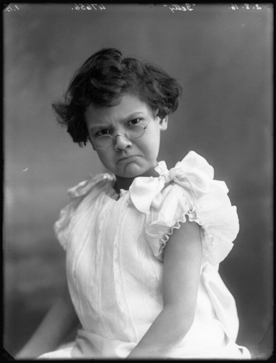
{: style="text-align: center;"}

[Betty Bolton as the Super-Child in the scene 'A Modern Mother's Meeting' in 'Some'](https://www.npg.org.uk/collections/search/portrait/mw73352/Betty-Bolton-as-the-Super-Child-in-the-scene-A-Modern-Mothers-Meeting-in-Some?LinkID=mp66598&role=sit&rNo=0)  
by Bassano Ltd (2 August 1916)  
© National Portrait Gallery, London
{:.figcaption}

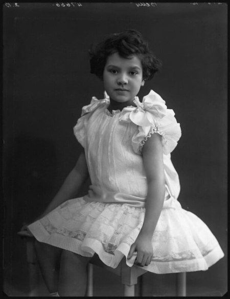
{: style="text-align: center;"}

[Betty Bolton as the Super-Child in the scene 'A Modern Mother's Meeting' in 'Some'](https://www.npg.org.uk/collections/search/portrait/mw73353/Betty-Bolton-as-the-Super-Child-in-the-scene-A-Modern-Mothers-Meeting-in-Some?LinkID=mp66598&role=sit&rNo=1)  
by Bassano Ltd (2 August 1916)  
© National Portrait Gallery, London
{:.figcaption}

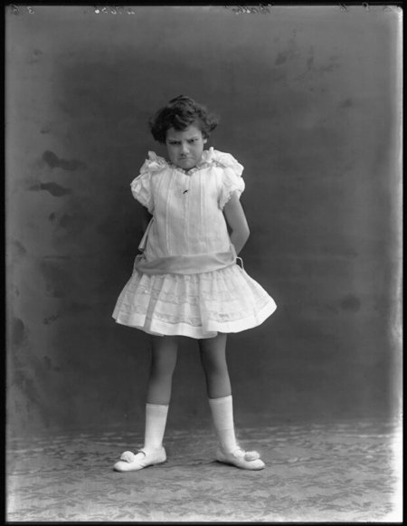
{: style="text-align: center;"}

[Betty Bolton as the Super-Child in the scene 'A Modern Mother's Meeting' in 'Some'](https://www.npg.org.uk/collections/search/portrait/mw73354/Betty-Bolton-as-the-Super-Child-in-the-scene-A-Modern-Mothers-Meeting-in-Some?LinkID=mp66598&role=sit&rNo=2)  
by Bassano Ltd (2 August 1916)  
© National Portrait Gallery, London
{:.figcaption}

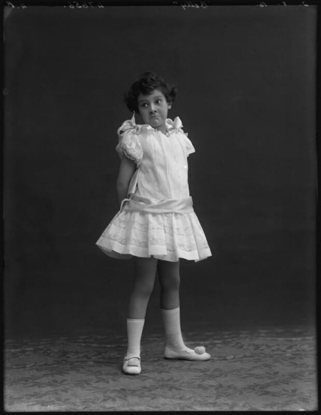
{: style="text-align: center;"}

[Betty Bolton as the Super-Child in the scene 'A Modern Mother's Meeting' in 'Some'](https://www.npg.org.uk/collections/search/portrait/mw73355/Betty-Bolton-as-the-Super-Child-in-the-scene-A-Modern-Mothers-Meeting-in-Some?LinkID=mp66598&role=sit&rNo=3)  
by Bassano Ltd (2 August 1916)  
© National Portrait Gallery, London
{:.figcaption}

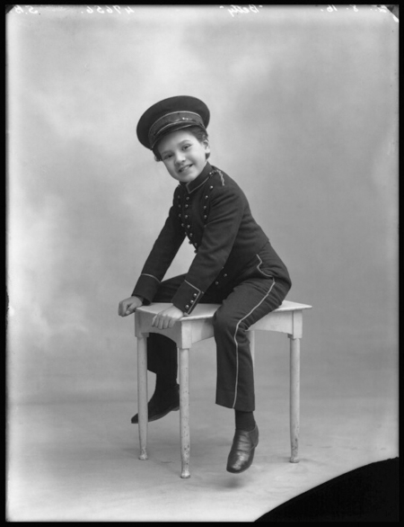
{: style="text-align: center;"}

[Betty Bolton as the Call-Boy in the dressing-room scenes in 'Some'](https://www.npg.org.uk/collections/search/portrait/mw73356/Betty-Bolton-as-the-Call-Boy-in-the-dressing-room-scenes-in-Some?LinkID=mp66598&role=sit&rNo=4)  
by Bassano Ltd (2 August 1916)  
© National Portrait Gallery, London
{:.figcaption}

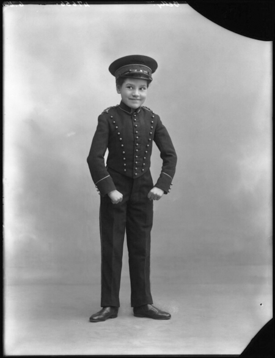
{: style="text-align: center;"}

[Betty Bolton as the Call-Boy in the dressing-room scene in 'Some'](https://www.npg.org.uk/collections/search/portrait/mw73357/Betty-Bolton-as-the-Call-Boy-in-the-dressing-room-scene-in-Some?LinkID=mp66598&role=sit&rNo=5)  
by Bassano Ltd (2 August 1916)  
© National Portrait Gallery, London
{:.figcaption}

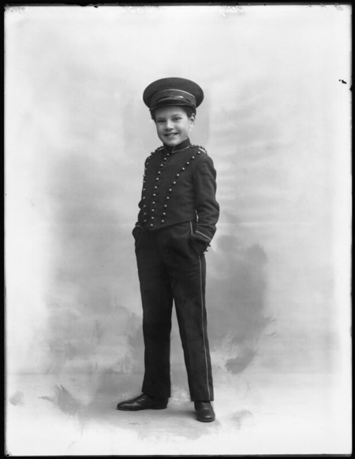
{: style="text-align: center;"}

[Betty Bolton as the Call-Boy in the dressing-room scenes in 'Some'](https://www.npg.org.uk/collections/search/portrait/mw73358/Betty-Bolton-as-the-Call-Boy-in-the-dressing-room-scenes-in-Some?LinkID=mp66598&role=sit&rNo=6)  
by Bassano Ltd (2 August 1916)  
© National Portrait Gallery, London
{:.figcaption}

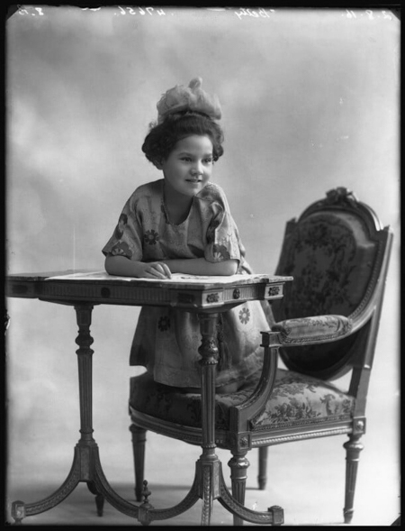
{: style="text-align: center;"}

[Betty Bolton as the Real Child in the 'Nursery' scene in 'Some'](https://www.npg.org.uk/collections/search/portrait/mw73359/Betty-Bolton-as-the-Real-Child-in-the-Nursery-scene-in-Some?LinkID=mp66598&role=sit&rNo=7)  
by Bassano Ltd (2 August 1916)  
© National Portrait Gallery, London
{:.figcaption}

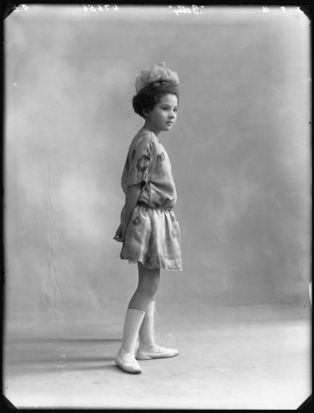
{: style="text-align: center;"}

[Betty Bolton as the Real Child in the 'Nursery' scene in 'Some'](https://www.npg.org.uk/collections/search/portrait/mw73360/Betty-Bolton-as-the-Real-Child-in-the-Nursery-scene-in-Some?LinkID=mp66598&role=sit&rNo=8)  
by Bassano Ltd (2 August 1916)  
© National Portrait Gallery, London
{:.figcaption}

## 1929

{: style="text-align: center;"}

Betty Bolton in *Wireless Magazine* (September 1929)  
From the collection of the late Mick Johnson
{:.figcaption}

## 1932

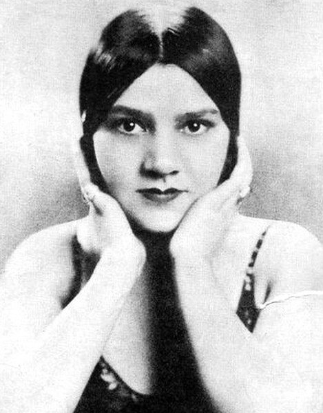
{: style="text-align: center;"}

Betty Bolton in 1932  
From the collection of John Wright
{:.figcaption}

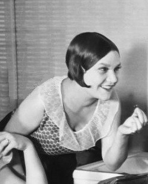
{: style="text-align: center;"}
 
Betty Bolton puts on special makeup to highlight her features for the first official BBC television program (1932)  
From the collection of John Wright
{:.figcaption}

## 1936

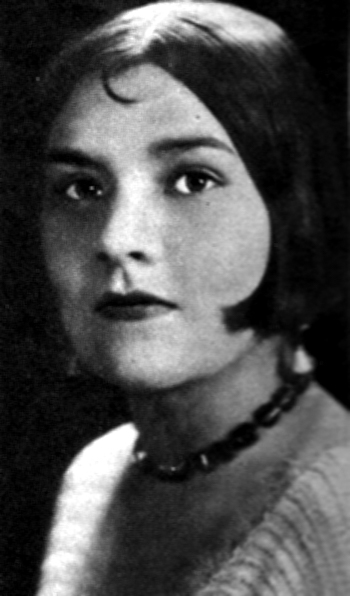
{: style="text-align: center;"}

Betty Bolton in 1936  
(A version of this picture appears in the July 3, 1936 issue of *Radio Pictorial* and is described as being then current)  
From the collection of Terry Brown
{:.figcaption}

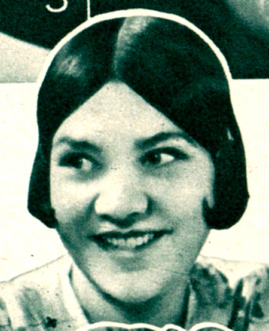
{: style="text-align: center;"}

Betty Bolton in the 1936 *Radio Pie: Your Guide to the B.B.C. Stars* (the actual photo may have been taken earlier)  
From the collection of Terry Brown
{: .figcaption}
